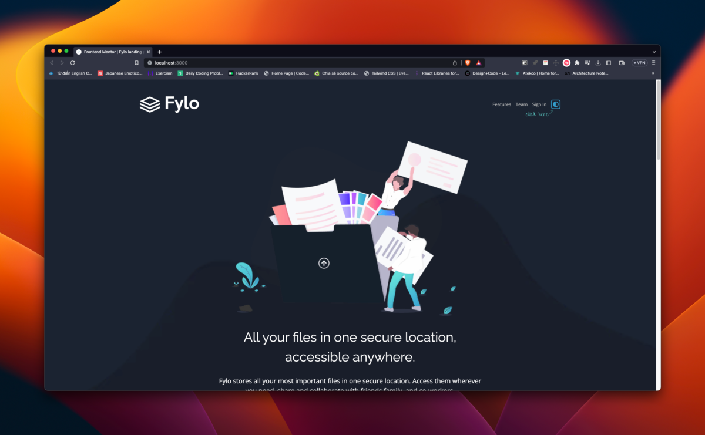

# Frontend Mentor - Fylo dark theme landing page solution

This is a solution to the [Fylo dark theme landing page challenge on Frontend Mentor](https://www.frontendmentor.io/challenges/fylo-dark-theme-landing-page-5ca5f2d21e82137ec91a50fd). Frontend Mentor challenges help you improve your coding skills by building realistic projects.

## Table of contents

- [Overview](#overview)
  - [The challenge](#the-challenge)
  - [Screenshot](#screenshot)
  - [Links](#links)
- [My process](#my-process)
  - [Built with](#built-with)
  - [What I learned](#what-i-learned)
  - [Continued development](#continued-development)
  - [Useful resources](#useful-resources)
- [Author](#author)
- [Acknowledgments](#acknowledgments)

## Overview

### The challenge

Users should be able to:

- View the optimal layout for the site depending on their device's screen size
- See hover states for all interactive elements on the page

### Screenshot





### Links

- Solution URL: [Add solution URL here](https://your-solution-url.com)
- Live Site URL: [Add live site URL here](https://your-live-site-url.com)

## My process

### Built with

- Semantic HTML5 markup
- CSS custom properties
- Flexbox
- CSS Grid
- Mobile-first workflow
- Typescript
- [Astro](https://astro.build/) - JS library
- [Tailwindcss](https://tailwindcss.com) - Tailwindcss

### What I learned

- Building a web from scratch using Astro JS and styling seperated components with all CSS using CUBE CSS methodology with tailwinds as Utilities class;
- Create an reusable Astro component with Polymorphic attribute
- Combining 2 project design form FEM to one optimal layout using exceptions from CUBE CSS
- Adding toggle color theme to switch between dark and lightmode

```css
.btn[data-style="button"] {
  @apply bg-accent-cta hover:bg-accent-cta-hover hover:text-opacity-80 focus-visible:bg-accent-cta-hover [&_span]:mx-auto;
}

.btn[data-size="md"] {
  @apply px-8 py-3 min-w-max w-full sm:w-auto;
}
.btn[data-style="link"] {
  @apply font-heading text-[length:clamp(0.786rem,0.25vw+1rem,1.143rem)] underline underline-offset-4 decoration-accent-cta-hover;
}
```

```js
type Props<Tag extends HTMLTag> = Polymorphic<{ as: Tag }> & {
  text: string;
  style: "button" | "link" | "link-large" | "toggle";
  icon?: {
    name: string;
    side: "left" | "right";
  };
};

const { text, style, icon, class: className, as: Tag, ...attr } = Astro.props;
---

<Tag class:list={["btn ", className]} data-style={style} {...attr}>
  {
    icon && icon.side === "left" && (
      <Icon name={icon.name} height="auto" width="auto" />
    )
  }
  <span>{text}</span>
  {
    icon && icon.side === "right" && (
      <Icon name={icon.name} height="auto" width="auto" />
    )
  }
</Tag>
```

### Continued development

- I am going to keep trying to have a good grasp of using Astro JS for static site in next advanced projects.
- Fully comprehend the Astro library 's functions by building dynamic data fetching SSR components in the future projects.

### Useful resources

- [Astro Crash Course](https://www.youtube.com/watch?v=zrPVTf761OI)
- [CUBE CSS](https://cube.fyi/)

## Author

- Frontend Mentor - [@Antonio0402](https://www.frontendmentor.io/profile/Antonio0402)

## Acknowledgments

So much thanks specially to Christ Pennington Youtube Chanel for helpful content on Astro JS. This is also one of my very 'worth to refer' chanel for FEM challenges and best practices for Astro JS.
